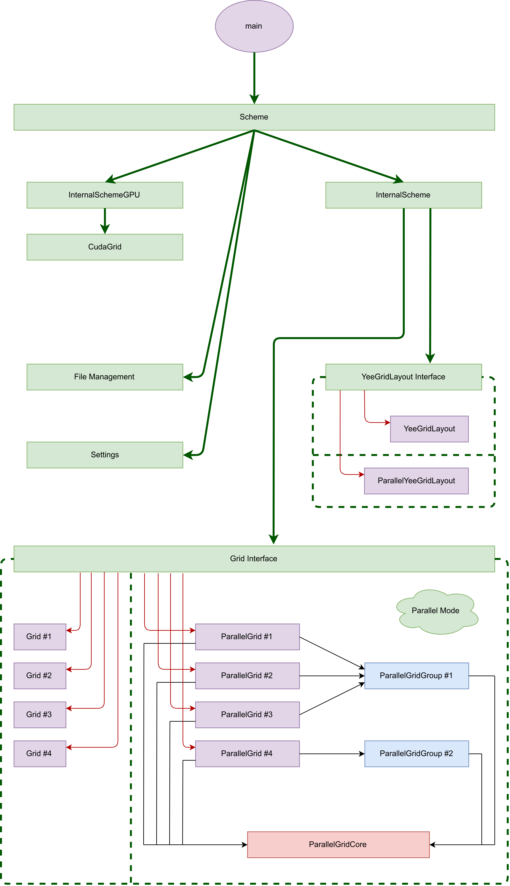
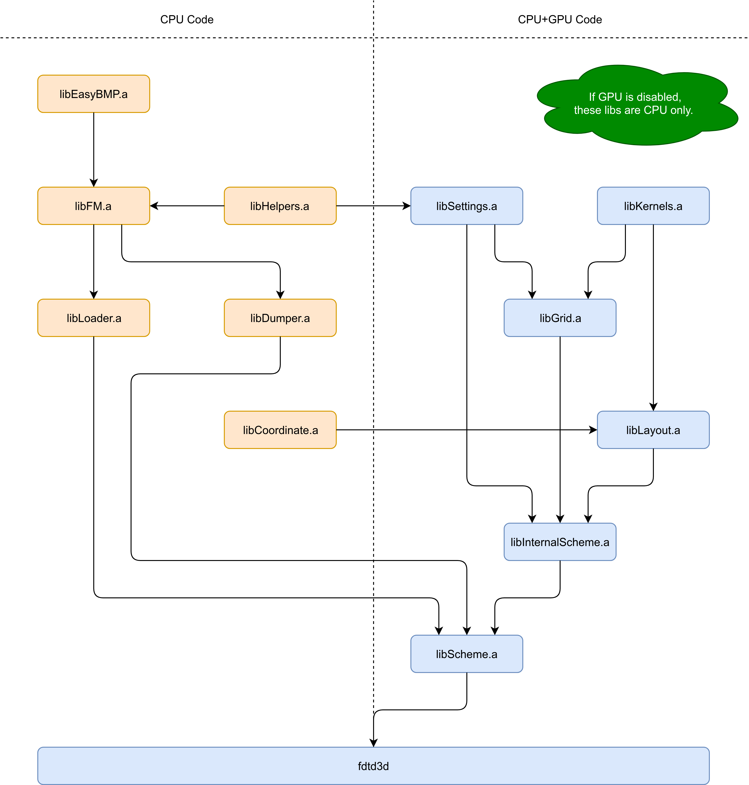
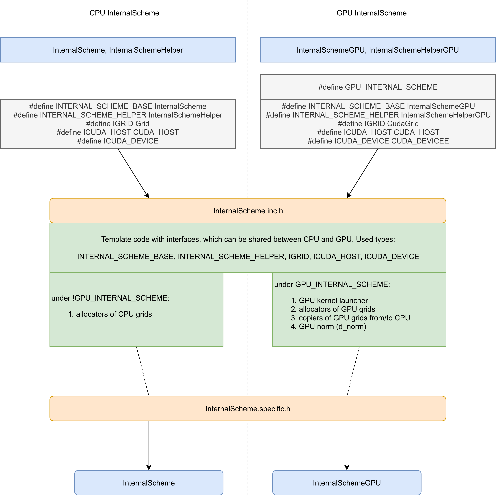

# High-Level Design

Next picture shows very high-level design of components interaction, starting from main and ending with data accesses in Grids.

# Library Dependencies

Next picture shows components dependencies and which libs are linked.

# Code Reusage CPU/GPU

In order to minimize code duplication between CPU and GPU, code of InternalScheme is shared between CPU and GPU. Core of InternalScheme is the same for both, however, each one has to contain specific methods.

`InternalScheme.inc.h` is template file, using interface types (like `IType`). `InternalScheme.specific.h` contains code specific for CPU of GPU. Next picture shows code reusage between CPU and GPU (see `InternalScheme.h`).

