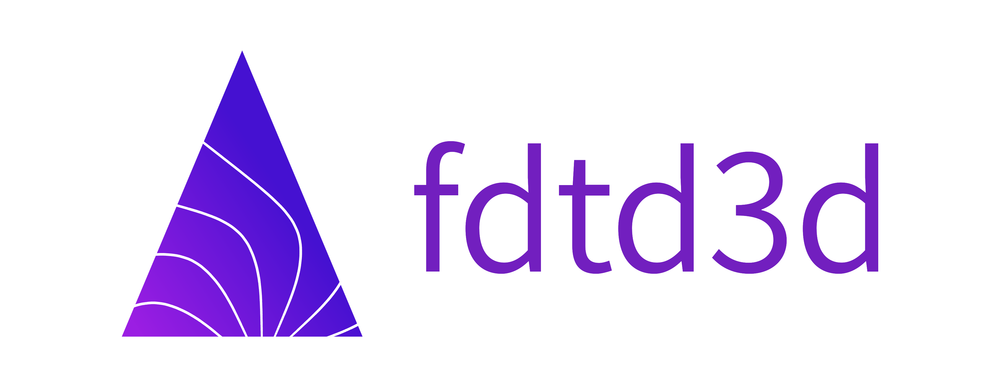

[](https://github.com/zer011b/fdtd3d/actions/workflows/build.yml/) [](https://github.com/zer011b/fdtd3d/actions/workflows/build-cuda.yml/) [](https://github.com/zer011b/fdtd3d/actions/workflows/build-arm.yml/) [](https://github.com/zer011b/fdtd3d/actions/workflows/build-arm64.yml/) [](https://github.com/zer011b/fdtd3d/actions/workflows/build-riscv64.yml/)

[](https://github.com/zer011b/fdtd3d/actions/workflows/unit-test.yml/) [](https://github.com/zer011b/fdtd3d/actions/workflows/unit-test-cuda.yml/) [](https://github.com/zer011b/fdtd3d/actions/workflows/unit-test-arm.yml/) [](https://github.com/zer011b/fdtd3d/actions/workflows/unit-test-arm64.yml/) [](https://github.com/zer011b/fdtd3d/actions/workflows/unit-test-riscv64.yml/)

[](https://github.com/zer011b/fdtd3d/actions/workflows/test-suite.yml/)

# fdtd3d

This is an open-source implementation of FDTD Maxwell's equations solver for different dimensions (1, 2 or 3) with support of concurrency (MPI/OpenMP/Cuda) if required and for different architectures (x64, Arm, Arm64, RISC-V). The key idea is building of solver for your specific needs with different components, i.e. concurrency support with enabled MPI, OpenMP or GPU support, parallel buffer types, specific dimension and others. OpenMP support is WIP.

For additional info on current project development status and future plans check issues and milestones, design docs are available at [documentation](Docs/Design.md). Also, doxygen documentation can be generated from config in `./Doxyfile`:

```sh
sudo apt-get install doxygen
doxygen
firefox docs/index.html
```

# Build

Build is done using cmake:

```sh
mkdir Release
cd Release
cmake .. -DCMAKE_BUILD_TYPE=Release
make
```

See [documentation](Docs/Build.md) for specific details.

# Testing

See [documentation](Docs/Testing.md) for specific details.

# Launch

Parameters can be passed directly to `fdtd3d` through command line or config file. See [documentation](Docs/Launch.md) for specific details.

```sh
# show help
./fdtd3d --help

# show version of solver
./fdtd3d --version

# example of launch command for 3D build
./fdtd3d --load-eps-from-file /tmp/eps.txt --save-res --time-steps 10 --size x:80 --same-size --use-tfsf \
         --3d --angle-phi 0 --use-pml --dx 0.0005 --wavelength 0.02 --save-cmd-to-file cmd.txt

# example of the same launch with command line file
./fdtd3d --cmd-from-file cmd.txt

# cmd.txt file has the next format
#
# --load-eps-from-file /tmp/eps.txt
# --save-res
# --time-steps 1
# --size x:80
# --same-size
# --use-tfsf
# --3d
# --angle-phi 0
# --use-pml
# --dx 0.0005
# --wavelength 0.02
```

# How To Cite

You can site the following papers about the techniques used in fdtd3d:

- Balykov G. (2017) Parallel FDTD Solver with Optimal Topology and Dynamic Balancing. In: Voevodin V., Sobolev S. (eds) Supercomputing. RuSCDays 2017. Communications in Computer and Information Science, vol 793. Springer, Cham. https://doi.org/10.1007/978-3-319-71255-0_27

- Balykov G. (2019) Parallel FDTD Solver with Static and Dynamic Load Balancing. In: Voevodin V., Sobolev S. (eds) Supercomputing. RuSCDays 2018. Communications in Computer and Information Science, vol 965. Springer, Cham. https://doi.org/10.1007/978-3-030-05807-4_26

# Third Party

EasyBMP lib is used to output resulting electromagnetic fields. It is downloaded from sourceforge and used as is.
