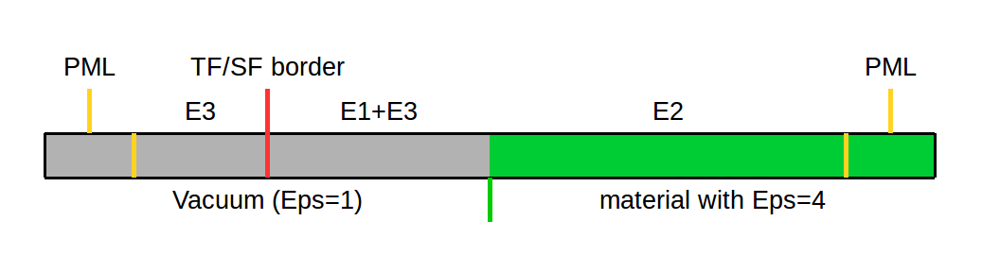
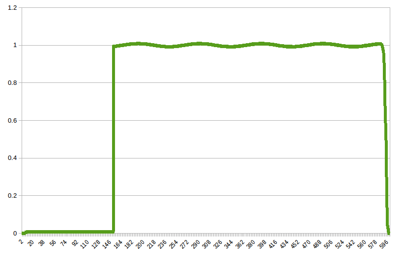
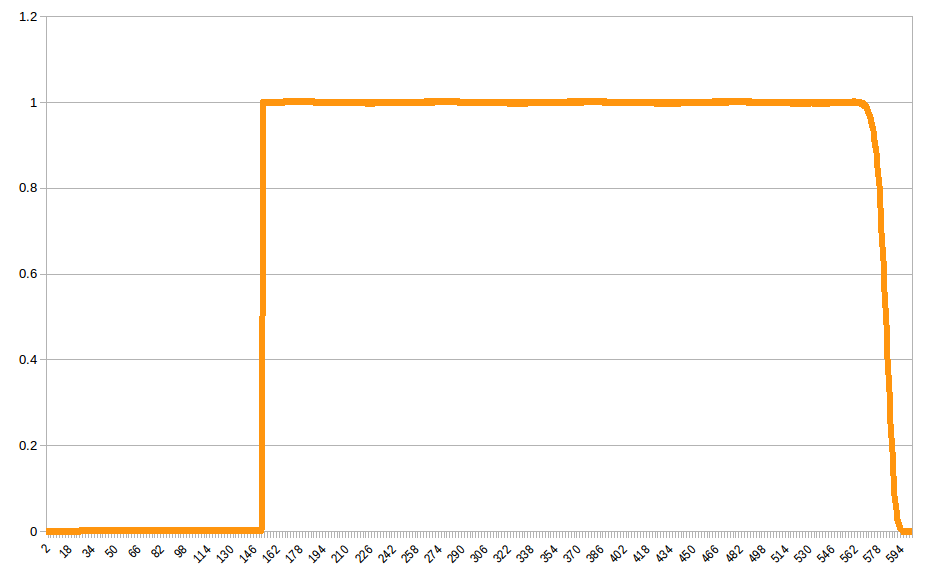
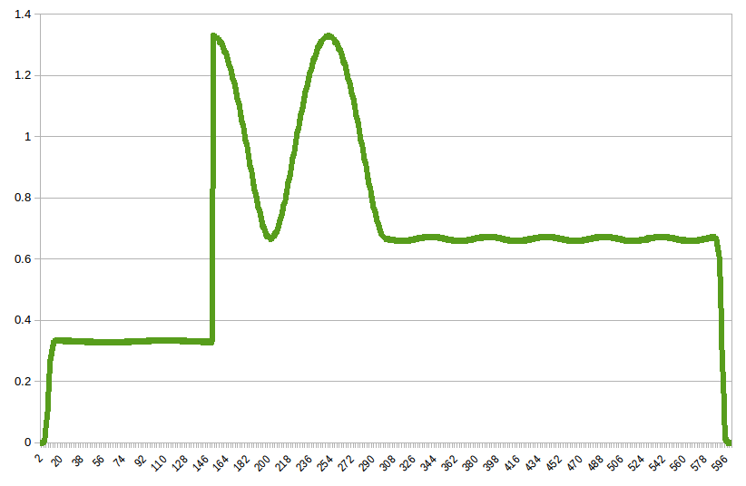
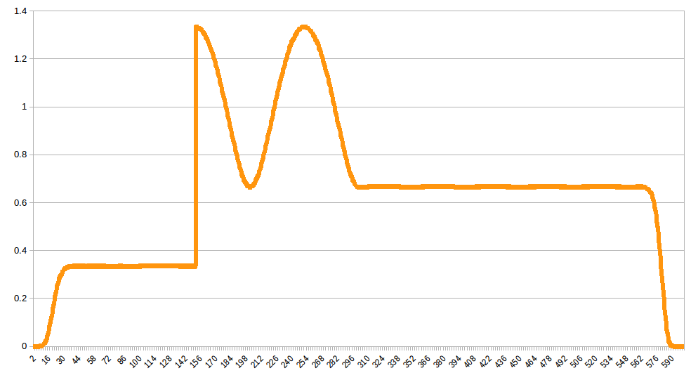

# Description

This is test with plane wave in vacuum in 1D mode with PML border condition and optional dielectric in total field area.

Numerical solution is compared with analytical both in terms of amplitude and phase. `ExHy` 1D mode is used.

# Detailed Description

- PML is set on both sides of grid
- **only left TF/SF border is used**, i.e. scattered field exists to the left of border, total field exists to the right
- incident wave goes from vacuum on the left side to the material on the right side, which can be either `Eps=4` or vacuum itself (`Eps=1`); `Mu=1` for all cases
- incident wave (E1, H1), refracted wave (E2, H2), reflected wave (E3, H3)

Example of grid layout with material with `Eps=4`:


# Analytical solution

## Case of material with `Eps=1`

In this case no reflection happens, i.e. wave passes without changes
```
E2 = H2 = 0
E3 = E1
H3 = H1
```

## Case of material with `Eps=4`

In this case wave is refracted and reflected. Let Oz axis be set and z1 be coordinate of border between vacuum and material.

Incident wave
```
E1 = i * e^(i*k*(z-z0) - i*w*(t-t0))
t0 = 0.5 * dt
```

t0 is 0.5 of dt due to the fact that incident wave calculation starts at half of the first time step. z0 is the start coordinate of incident wave (depend on the coordinate, at which auxiliary TF/SF grid is set up).

In order to obtain refracted and reflected wave border conditions at `z=z1` are considered. Reflection index is `n=sqrt(eps*mu)=2`. As the wave vector is orthogonal to border, no angle changes arise. That leads to next fields:

```
E2 = -1/3 * i * e^(-i*k*z + i*k*(2*z1-z0) - i*w*(t-t0))
E3 = 2/3 * i * e^(i*k_2*z - i*k_2*0.5*(z1 + z0) - i*w*(t-t0))
```

For all the fields:
```
H = k/(Mu*Mu0*w) * E = k/(Mu0 * w) * E
```

# Numerical Result

Norm of difference between exact and numerical solution is calculated. For both cases amplitude and real/imaginary parts accuracy is less than 0.7% for PML size 20 and less than 0.17% for PML size 50 (see next configs for examples: [vacuum](sphere1D_vacuum.txt) and [material](sphere1D_eps4.txt))

## Case of material with `Eps=1`

Amplitude of E field (TF/SF border at grid point 150, PML size is 20):


Amplitude of E field (TF/SF border at grid point 150, PML size is 50):


## Case of material with `Eps=4`

Amplitude of E field (TF/SF border at grid point 150, PML size is 20, border between vacuum and material at 300):


Amplitude of E field (TF/SF border at grid point 150, PML size is 50, border between vacuum and material at 300):

